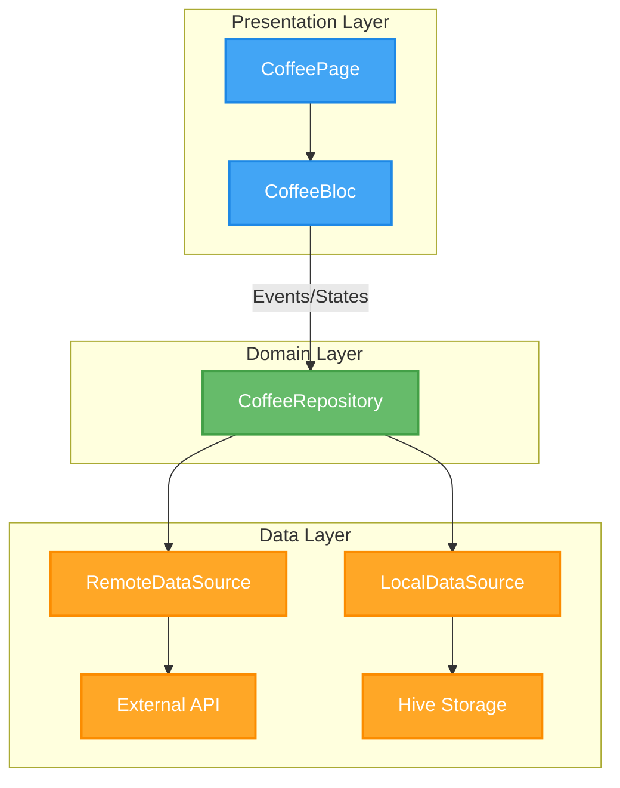

# Coffee App

![coverage][coverage_badge]
[![style: very good analysis][very_good_analysis_badge]][very_good_analysis_link]
[![License: MIT][license_badge]][license_link]

A Flutter application for browsing and saving coffee images, built with a clean, feature-first architecture.

## Features ✨

*   **Random Coffee Generator**: Fetch and view random coffee images from an external API.
*   **Favorites Management**: Save your favorite coffee images locally and view them offline.
*   **Theme Support**: Toggle between Light and Dark modes for a comfortable viewing experience.
*   **Internationalization**: Full support for English (`en`) and Spanish (`es`) locales.
*   **Offline First**: Cached images and local storage ensure functionality even without an internet connection.

## Architecture 🏗️

This project follows a **Feature-First & Layered Architecture** to ensure scalability, testability, and maintainability.

### Core Principles

*   **Feature-First**: Code organization is based on business features (e.g., `coffee`) rather than technical layers.
*   **Clean Architecture**: Separation of concerns between Data, Domain, and Presentation layers.
*   **BLoC Pattern**: State management uses the [Business Logic Component (BLoC)](https://bloclibrary.dev/) pattern to separate business logic from UI.

### Dependency Injection

Dependencies are managed using `RepositoryProvider` from `flutter_bloc` to inject repositories into the widget tree.

### Architecture Diagram



---

## Getting Started 🚀

This project contains 3 flavors:

- development
- staging
- production

To run the desired flavor either use the launch configuration in VSCode/Android Studio or use the following commands:

```sh
# Development
$ flutter run --flavor development --target lib/main_development.dart

# Staging
$ flutter run --flavor staging --target lib/main_staging.dart

# Production
$ flutter run --flavor production --target lib/main_production.dart
```

_\*Coffee App works on iOS, Android, Web, and Windows._

---

## Running Tests & Coverage 🧪

We aim for **100% test coverage** to ensure reliability and minimize regressions.

To run all unit and widget tests:

```sh
$ flutter test --coverage
```

To view the generated coverage report:

```sh
# Generate & Open Coverage Report (macOS)
$ genhtml coverage/lcov.info -o coverage/
$ open coverage/index.html
```

---

## Working with Translations 🌐

This project relies on [flutter_localizations][flutter_localizations_link] and follows the [official internationalization guide for Flutter][internationalization_link].

1.  Add new strings to `lib/l10n/arb/app_en.arb`.
2.  Run `flutter gen-l10n` to generate the Dart code.
3.  Use `context.l10n.yourString` in the UI.

[coverage_badge]: coverage_badge.svg
[flutter_localizations_link]: https://api.flutter.dev/flutter/flutter_localizations/flutter_localizations-library.html
[internationalization_link]: https://flutter.dev/docs/development/accessibility-and-localization/internationalization
[license_badge]: https://img.shields.io/badge/license-MIT-blue.svg
[license_link]: https://opensource.org/licenses/MIT
[very_good_analysis_badge]: https://img.shields.io/badge/style-very_good_analysis-B22C89.svg
[very_good_analysis_link]: https://pub.dev/packages/very_good_analysis
